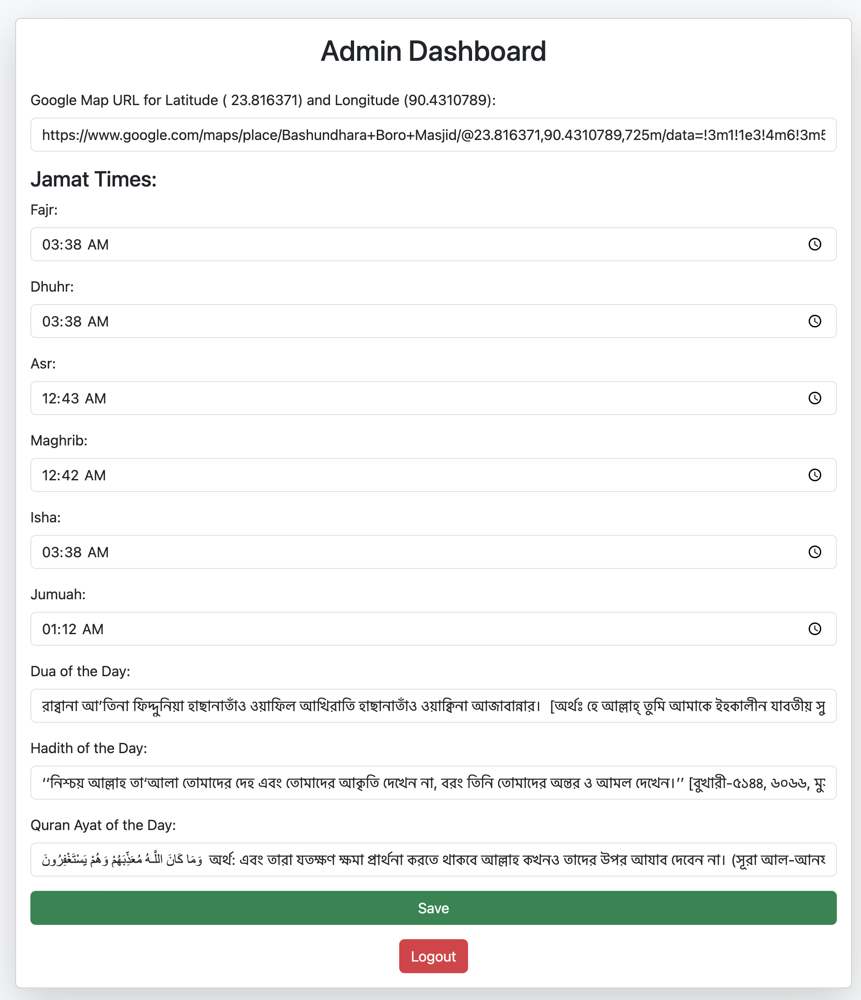
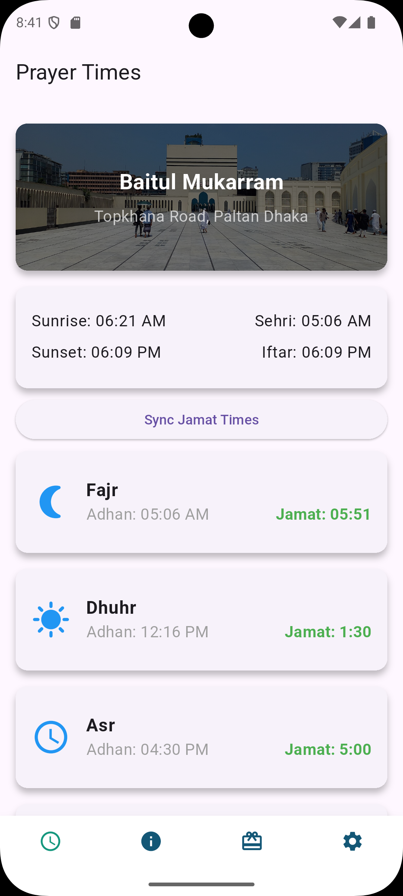

নিজ নিজ লোকাল মসজিদের নামাজের সময় জামাতের সময় দেখার জন্য অ্যাপ। ব্যাকেন্ডে প্লেইন পিএইচপি ব্যবহার করা হয়েছে। নির্দিষ্ট মসজিদের লোকেশন থেকে আজানের সময়, সেহেরি এবং ইফতারের সময় সূচি ক্যালকুলেশন করার জন্য **[prayer-times](https://github.com/islamic-network/prayer-times)** লাইব্রেরী ব্যবহার করা হয়েছে। সিম্পল পিএইচপি ব্যবহার করায় যে কোন পিএইচপি সার্ভারেই ঝামেলা ছাড়া হোস্ট করা যাবে। ওয়েবসাইটের সিম্পল আউটলুকঃ

জামাতের সময় সেট করার জন্য সিম্পল একটা অ্যাডমিন ড্যাশবোর্ড যোগ করা হয়েছে। যেখানে লগিন করে নির্দিষ্ট মসজিদের জামাতের সময় সেট করা যাবে। ঐখানে মসজিদের গুগল ম্যাপ লোকেশন সেট করা যাবে। যার উপর ভিত্তি করে নামাজের সময় গুলো দেখাবে। অ্যাডমিন ড্যাশবোর্ডঃ

জামাতের সময় সেট করার পর সে ডেটা গুলো সেভ হবে data.json ফাইলে। যে ডেটা আমরা মোবাইল থেকে অ্যাপে সিঙ্ক করে নিতে পারব। ফ্লাটার দিয়ে সিম্পল একটা অ্যাপ তৈরি করেছি। যেখানে নির্দিষ্ট মসজিদের জামাতের সময় দেখা যাবে। 

অ্যাপ ফ্লাটারে তৈরি করার কারণে যে কেউ অ্যান্ড্রয়েড এবং আইওএসের জন্য অ্যাপ বিল্ড করে নিতে পারবেন। 
